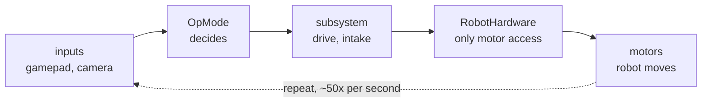
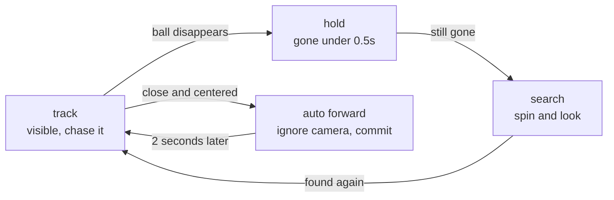

# Start Here

You just joined. You've never seen this code. This page is 10 minutes long.

Read this one first. Then `NEW_MEMBER_GUIDE.md`. Then the architecture guide.

---

## A match has two halves

Every FTC match runs in two parts, and both use the same code style:

| | **Autonomous** | **TeleOp** |
|---|---|---|
| How long | first 30 seconds | the rest of the match |
| Who's driving | nobody — the robot is alone | humans, with gamepads |
| Our files | `opmodes/auto/` | `opmodes/TeleOpMode*.java` |

Most of the examples in this doc come from TeleOp, because that's where most of
our code currently lives. But **everything below applies to both.** The robot
thinks the same way whether a human is holding the controller or not — the only
difference is where the instructions come from. In TeleOp it reads a gamepad. In
Autonomous it reads its own plan.

---

## Start with cruise control

Your code does **not** say "drive forward three feet."

You know cruise control in a car. You set it to 65 and take your foot off the gas.

The car isn't "going 65." It's *checking*, over and over: **am I at 65 yet?** A
little slow — give it more gas. A little fast — ease off. Going uphill — push
harder. You never notice any of it, because the corrections are tiny and constant.

Our robot works the same way. It asks your code the same question **about 50
times per second**:

> *"Right now, this instant — what power should each motor get?"*

Your whole job is answering that one question, over and over. That's this:

```java
while (opModeIsActive()) {
    // this runs ~50 times a second, until the match ends
    // look at the gamepad, look at the camera, decide powers, set them
}
```

So "drive forward three feet" really means:

> *Set forward power. Check the sensors. Not there yet? Set it again. Check
> again. Still not there? Again... okay, we're there — power to zero.*

**Why not just command three feet?** Because the world pushes back. Wheels slip.
Another robot rams you. The battery sags and the same power gives less speed than
it did a minute ago. A robot that commits to a plan can't notice any of that. So
it never commits — it re-decides, 50 times a second, from what's true *now*.

You are not steering the robot. You are **giving advice 50 times a second.**

Once this clicks, the rest of the code stops looking weird.

---

## The robot has to remember things

Here's the catch. Every pass through that loop is a **clean slate**.

Think of each pass as working on **scratch paper that gets thrown away** the
moment the pass ends. Anything written on it is gone. If the robot needs to
remember something from one pass to the next, it has to be written on the
**whiteboard on the wall** instead — the variables declared at the top of the
class, outside the loop. Scratch paper for this-pass-only math; whiteboard for
anything that must survive.

That's why you'll see lines like this at the top of the file:

```java
private boolean isSeekMode = false;   // survives every pass
private double turn = 0;              // survives every pass
```

`isSeekMode` has to survive, or pressing A once wouldn't stay on — it'd forget
instantly. And `turn` is sneakier: it holds the **last steering command**, so when
the ball vanishes off the right edge of the camera, the robot still knows it was
turning right and searches that way instead of spinning off the wrong direction.

Move either one inside the loop and it resets 50 times a second. Same logic, one
word moved, and the robot goes stupid.

## "Pressed" and "held" are different things

This one causes more robot bugs than anything else on this page, so here's the
whole idea as a game:

Imagine I ask you, **once per second**: *"Is your hand raised?"*

You raise your hand for three seconds. You answered "yes" **three times** — even
though you only raised it *once*. Now change the question to *"did your hand
**just go up**?"* — and you'd answer yes, no, no. One yes for one raise.

Same hand, same three seconds, completely different answers. The first question
asks about a **state** (what's true right now). The second asks about a
**change** (what just became true).

Now speed it up: the robot asks its question **50 times a second**, and a human
"tap" on a button lasts about a tenth of a second — five questions' worth. So:

| The code asks | Answers during one tap | The action fires |
|---|---|---|
| "is the button down?" | yes, yes, yes, yes, yes | **5 times** |
| "did it just go down?" | yes, no, no, no, no | **once** |

Anything that should happen *once per press* — toggle a mode, start a timer —
must ask the second question. And to know something *changed*, you have to
remember what it was last time. That's a whiteboard job:

```java
boolean aPressed = gamepad1.a;
if (aPressed && !prevAPressed) {    // down NOW, and NOT down last pass
    // fires exactly once per press
}
prevAPressed = aPressed;            // remember for next pass — every pass!
```

You'll see this exact pattern in our TeleOp for the `A` and `back` buttons. When
you add a button of your own, copy it.

## And "do this for 2 seconds" is not what you'd guess

Your instinct is `Thread.sleep(2000)`. **Never do that here.** For those 2 seconds
the loop is frozen — the robot ignores the camera, the gamepad, and the STOP
button. Blind and unstoppable.

It's the difference between two cooks waiting on a toaster. One **stands frozen,
staring at it** until it pops — ignoring the stove, the phone, the fire alarm.
That's `sleep`. The other **sets a kitchen timer and keeps cooking**, glancing at
it each time they pass. That's how the robot does it: a stopwatch that lives
outside the loop. Start it once...

```java
autoForwardMode = true;
autoForwardTimer.reset();      // stopwatch back to 0.00 and running
```

...then just *check* it every pass and move on:

```java
if (autoForwardMode) {
    if (autoForwardTimer.time() >= 2.0) {
        autoForwardMode = false;        // 2 seconds are up — done
    } else {
        forward = 0.4;                  // not yet — keep going
    }
}
```

The loop never stops running. It just answers "still going" each pass until the
stopwatch reads 2.0.

**That's the pattern for every timed thing on the robot:** a `boolean` for *am I
doing this*, a stopwatch for *how long have I been*, both outside the loop,
checked once per pass. Nothing waits. Everything checks.

---

## Who answers the question — the kitchen

So the loop asks "what power, right now?" 50 times a second. *Who* actually
answers? That's where our folders come in. Think of a restaurant kitchen.

- **The OpMode is the waiter.** It takes the order ("driver pushed the stick
  forward") and shouts it at the kitchen. The waiter never cooks.
- **The subsystems are the cooks.** One cook for driving, one cook for the
  intake. Each knows how to do exactly one job.
- **`RobotHardware` is the pantry.** It's the only one allowed to touch the
  actual ingredients — the motors. Cooks ask the pantry; they don't wander in.
- **`config/` is the recipe card.** All the numbers — how fast, how hard, how
  long — are written on the card, not memorized by the cooks.

Why bother? Say the intake motor gets moved to a different port. You change **one
word on the recipe card**. If everyone touched motors directly, you'd be hunting
through every file in the project.

Here's one trip through, start to finish:



That's the whole architecture. Everything else is detail.

---

## What our robot has

- **4 wheels** — the special kind that can slide sideways, not just forward
- **1 intake** — spinning rubber bands that pull balls in
- **1 camera** — looks for purple balls
- **1 position sensor** — keeps track of where the robot is on the field

That's it. Seven things.

---

## How the robot chases a ball

This is our coolest feature and it's simpler than it looks.

It currently lives in **TeleOp** — the driver presses `A` and hands the robot
control of itself for a bit. Worth knowing: this is exactly the kind of thing
autonomous needs, and moving it there is one of the bigger open projects on the
team.

**Seeing:** The camera looks for purple. When it finds a purple blob, it reports
back two useful things:

- *How far left or right is it?* — a number from **−1** (far left) to **+1**
  (far right). **0 means dead center.**
- *How big does it look?* — big means close, small means far away.

**Chasing:** Now here's the trick, and it's the single most useful idea in all
of robotics:

> **The more wrong you are, the harder you correct.**

You already do this. Catching up to a friend walking ahead of you: far behind,
you jog; getting close, you walk fast; beside them, you just match their pace.
Nobody taught you a rule — you correct in proportion to how far off you are.

The robot does the same with the ball. Way off to the right? Turn hard right.
*Slightly* right? Turn gently right. Centered? Don't turn at all.

You don't need `if` statements for that. You just multiply:

```java
turn = howFarOffCenter * 0.6;
```

If `howFarOffCenter` is big, `turn` is big. If it's small, `turn` is small. If
it's zero, `turn` is zero. **One line of multiplication replaces a whole pile of
if-statements** — and it's smooth instead of jerky.

That `0.6` is the "how aggressive" knob. Turn it up, the robot snaps toward the
ball but might overshoot and wobble. Turn it down, it's smooth but lazy.
Playing with that number is a genuinely good first task.

Same exact idea for driving forward — the smaller the ball looks, the harder we
drive at it.

**Two problems we had to fix:**

1. *The robot got the jitters.* The camera loses sight of the ball for a split
   second all the time — a shadow, a bad frame, whatever. The robot would panic
   and switch between "chase!" and "search!" several times a second. **Fix:**
   when the ball disappears, just keep doing whatever you were doing for half a
   second. It usually comes right back.

2. *The robot went blind at the finish line.* When it gets close to the ball,
   the ball slips out of the bottom of the camera's view — right when it's about
   to succeed. **Fix:** once we're lined up and close, stop looking at the
   camera entirely and just drive straight for 2 seconds. Commit to it.

Both fixes are the same lesson: **the sensor lies sometimes, so don't trust it
blindly.**

Put together, the robot is always in one of four behaviors:



---

## Two odd-looking things, explained

**Why is `clearBulkCache()` at the top of every loop?**

Asking a motor "how fast are you going?" takes a surprisingly long time. It's
like grocery shopping: six separate trips to the store for six items, versus one
trip with a list. We do the one trip — grab **all** the sensor readings in one
go and keep them in memory. `clearBulkCache()` means "that shopping is old,
make a fresh trip." If you forget it, your sensors quietly report the same
stale numbers forever, and you will lose an afternoon to it.

**Why doesn't the code crash when the camera is unplugged?**

On purpose. A car with a broken radio still drives — you'd never want the whole
car to refuse to start because the radio died. Same rule here: a robot that runs
*without* vision can still play the match, but a robot that crashes at startup
forfeits. So every risky piece of hardware is wrapped in "if this fails, keep
going without it." When you write new code, do the same.

---

## Do these five things this week

1. Open the project in Android Studio and get it onto the robot. Check that
   **"V1 TeleOp"** shows up on the Driver Station.
2. **Change one number and feel the difference.** The robot has a "slow mode":
   hold the right trigger and it drops to 30% speed, so the driver can line up
   carefully near the scoring zone instead of overshooting. That 30% is one
   number — `TELEOP_PRECISION_SCALE = 0.3` in `DriveConfig.java`.

   Drive normally with the trigger held, and notice the speed. Now change `0.3`
   to `0.15`, redeploy, and drive again — slow mode is now half as fast as it
   was. **You just changed how the robot handles by editing one number.**
   (Then put it back, or ask the drivers which they prefer.)
3. Add `telemetry.addData("Hello", 123);` inside a loop and watch it appear on
   the Driver Station. This is how you debug — you can't pause a driving robot.
4. Run the ball seek. Press **A**. Watch the numbers on screen change as you
   move a ball around in front of the camera.
5. Ask someone what to build next.

**Two rules for your first pull request:**
- Numbers go in `config/`, never typed into the middle of an OpMode.
- Make a branch. Don't push straight to `main`.

---

## Words people will say at you

| Word | What they mean |
|---|---|
| **OpMode** | a program you run on the robot |
| **TeleOp** | the part of the match where humans drive |
| **Autonomous** | the first 30 seconds, robot drives itself |
| **Driver Station** | the tablet the drivers hold |
| **Control Hub** | the computer bolted to the robot |
| **Telemetry** | text on the Driver Station screen — like `System.out.println` |
| **Subsystem** | the code for one mechanism |
| **Pose** | where the robot is: x, y, and which way it's facing |
| **Mecanum** | our wheels — they can slide sideways |
| **Odometry** | figuring out where you are by counting wheel spins |

---

**Stuck? Ask.** Everyone here got stuck on the same things. Nobody will be
annoyed. Next: `NEW_MEMBER_GUIDE.md`.
